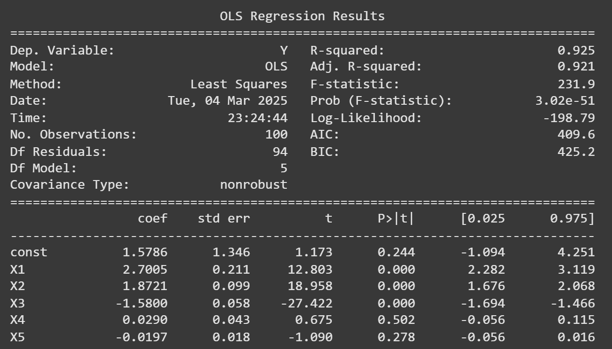
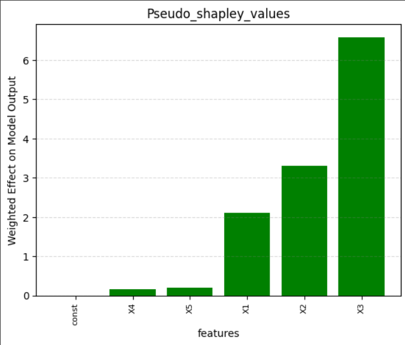

# Pseudo-Shapley-Value
This is a python program I wrote that calculates the strength of influence of features (pseudo-Shapley values) for machine learning algorithms built in python.
This is a program that takes in a dataframe, a machine learning model, and a specified number of iterations, as arguments. The code returns a bar plot with the column names on the x-axis and corresponding feature strength of effects on the y-axis. This can be used to determine which independent variables are important in a machine learning algorithm and which ones are less influential and may be irrelevant. This is process is model agnostic thus can be applied to almost any machine learning algorithm (ie neural networks, linear regression, random forest, XG boosted trees 
etc.) 
# Explanation of Files in this Repository:

## Making_Sample_Data.py

Making a sample dataset to test the program on (lines 11-43). I then make a model to predict the independent variable (Y) (lines 46). This program is model agnostic so this OLS model can be substituted with a neural network, random forest, XGboosted tree, or any other predictive algorithm. 

```
import numpy as np
import pandas as pd
import matplotlib.pyplot as plt
import statsmodels.api as sm
from sklearn.model_selection import train_test_split

# Below we create a sample dataframe and perform a linear regression
# to demonstrate the algorithm. 

# Set random seed for reproducibility
np.random.seed(42)

# Generate 100 samples
n = 100
# Create 3 significant features (with noise)
X1 = np.random.normal(0, 1, n)  # Significant feature 1
X2 = np.random.normal(5, 2, n)  # Significant feature 2
X3 = np.random.normal(10, 3, n)  # Significant feature 3

# Create 2 non-significant features (purely random noise)
X4 = np.random.normal(20, 5, n)  # Non-significant feature 1
X5 = np.random.normal(50, 10, n)  # Non-significant feature 2

# Create the dependent variable (Y) as a linear combination of X1, X2, and X3 with some noise
Y = 3 * X1 + 2 * X2 - 1.5 * X3 + np.random.normal(0, 2, n)

# Create a DataFrame
data = pd.DataFrame({
    'X1': X1,
    'X2': X2,
    'X3': X3,
    'X4': X4,
    'X5': X5,
    'Y': Y
})

# Split the data into features (X) and target (Y)
X = data[['X1', 'X2', 'X3', 'X4', 'X5']]
Y = data['Y']

# Add a constant to the independent variables (for the intercept in the model)
X = sm.add_constant(X)

# Fit the linear regression model
model = sm.OLS(Y, X).fit()

# Get the summary of the regression
summary = model.summary()

# Print the summary
print(summary)
```

## sample_data_regression_summary.png

This is the summary of the model created in [Making_Sample_Data.py]. I made the 3 of the five independent variables (X1, X2, X3)  statistically significant (aka informative) hence their small p-values. If I wrote the program correctly these three variables should have large values since they are literally designed to have a large strength of influence on the model’s predictions. The other two variables (X4, X5) should have small values because the model does not take their influence into consideration when making predictions. 



## Shapley_Value_function.py

This is the program that takes in a model and produces a bar plot that conveys the strength of influence of each variable. Variables with higher strengths of influence are interpreted to be more informative, important, and overall more relevant to the model’s predictions while variables with lower strength of influence are interpreted to be less informative (and oftentimes can be removed from the model altogether). 

```
def shapley_value(data_frame, input_model, iterations):
    feature_shapley_value_matrix = {}
    list_of_shapleys = []

    # Iterate over each column in the data frame (feature columns)
    for which_column in range(data_frame.shape[1]):
        feature_shapley_value_matrix[which_column] = []

        # Perform iterations to compute Shapley values
        for i in range(iterations):
            # Shuffle the rows of the data frame
            row_shuffled_dataframe = data_frame.sample(frac=1).reset_index(drop=True)

            # Select a random row from the shuffled data
            random_row = row_shuffled_dataframe.sample(n=1).reset_index(drop=True)

            # Make a copy of the row to alter
            random_row_altered = random_row.copy()

            # Alter the selected feature (column)
            random_row_altered.iloc[0, which_column] = data_frame.iloc[:, which_column].sample(n=1).values[0]

            # Calculate the difference in predictions
            original_prediction = input_model.predict(random_row)
            altered_prediction = input_model.predict(random_row_altered)
            difference = abs(original_prediction - altered_prediction)

            # Append the difference to the list for this feature
            feature_shapley_value_matrix[which_column].append(difference[0])

        # Compute the mean Shapley value for the feature
        mean_shapley_value = np.nanmean(feature_shapley_value_matrix[which_column])
        list_of_shapleys.append(round(mean_shapley_value, 3))

    return list_of_shapleys
shaps = shapley_value(X, model, 15)


values = shaps  # Heights of the bars
labels = X.columns.tolist()  # Labels for the x-axis


sorted_values, sorted_labels = zip(*sorted(zip(values, labels)))

# Create the bar plot
plt.bar(sorted_labels, sorted_values, color='green')
#plt.figure(figsize=(10, 6))
plt.grid(axis='y', linestyle='--', color='gray', alpha=0.3)

# Add labels and title (optional
#plt.bar(labels, shaps, width=.4)

# Add labels and title (optional)
plt.xlabel('features')
plt.ylabel('impacts')
plt.title('shapley_values')
plt.xticks(fontsize = 8,rotation=90)
# Show the plot
plt.show()


```

## Feature_Effects_on_output.png

This visual shows which variables the program found to be relevant. As we see X1, X2, and X3 have a very strong influence on the model’s output while X4 and X5 do not. This agrees with how the data was initially designed so I can be confident that my program is running correclty and will give me accurate information on the models I run it on!!!


